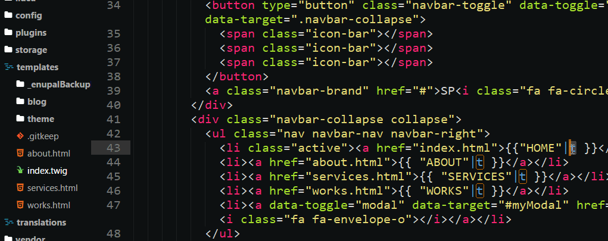
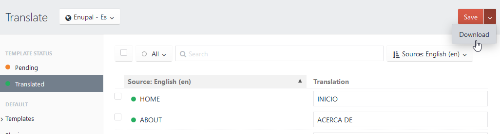
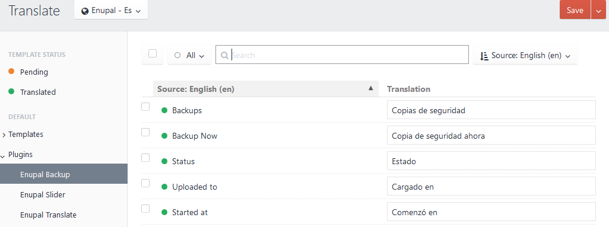

	

# Enupal Translate Plugin for Craft CMS 3.x

Translate your website templates and plugins into multiple languages. Bulk translation with Google Translate or Yandex.

## Features

### Translate your templates and plugins easily with

*  [Yandex](https://translate.yandex.com/)
*  [Google Translate](https://cloud.google.com/translate/?hl=es)
*  Manually

Translating your static texts has never been so easy:

### Download translations:

Download your translations as CSV file from the top right dropdown menu.

* For all templates
* Specific templates
* Plugins

### Plugin Developers!

Enupal translate will generate all the translation files in your Plugin Path. Internationalize your plugins to reach more users in different countries!

## Documentation

https://enupal.com/en/craft-plugins/enupal-translate/docs/

## Enupal Translate Support

Via Email:

Send us a note at: info@enupal.com

------------------------------------------------------------

Brought to you by [enupal](https://enupal.com/en)

	

