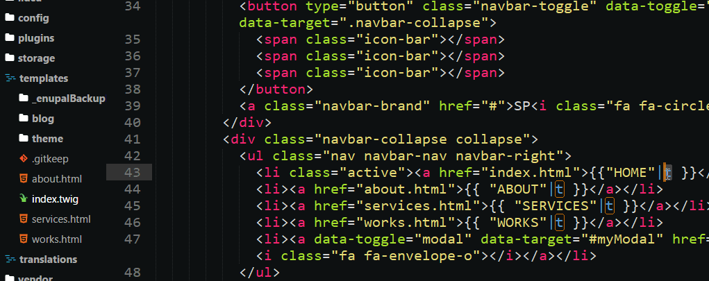
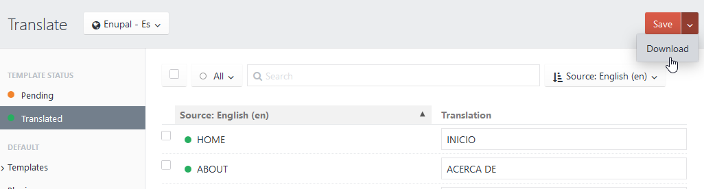
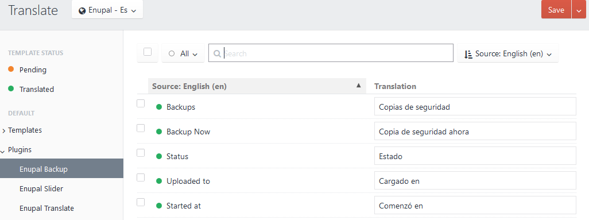

   

	

# Enupal Translate for Craft CMS 5

Translate entry content, templates and even plugins. With Google or AI.

A multi-site build needs two kinds of translation: the static strings in your
templates and plugins, and the content in your entries. Enupal Translate handles
both.

Pick a target site, hit Translate, review the draft. Bigger jobs run in the
background as Craft queue jobs, so you can carry on working.

> [!NOTE]
> Content translation and the AI providers are new in 5.0 and still being proven
> on real sites. Static template translation is unchanged. If you hit something,
> please [open an issue](https://github.com/enupal/translate/issues).

## Translate your content

Translate any entry, asset, category or product into another site from the
sidebar, or select several on the index and do them in bulk.

**Craft fields**

* Matrix, including nested blocks
* Plain Text
* Table — text columns only, numbers and dates left alone
* Link — the label, never the URL
* Content Block
* Asset alt text

**Rich text**

* CKEditor
* Redactor
* TinyMCE
* Vizy

**Plugin fields**

* Neo
* Super Table
* Hyper
* Linkit
* SEOmatic — only the fields you have overridden, so inheritance stays intact
* Ether SEO

Your own field types can join in through `Content::EVENT_REGISTER_SERIALIZERS`.

Everything else is left alone: images, dropdowns, numbers and relations are never
touched. Internal links follow the translation, so a link to an English entry
becomes a link to its Spanish counterpart.

## Translate your templates and plugins

Enupal Translate scans your templates for translatable strings and lets you
translate them in bulk or by hand.

### Sync with the database

Keeps a copy of your translations folder in the database, so you can deploy
without committing translations to git, and without extra queries slowing your
pages down.

### Import and export CSV

Export from the dropdown in the top right, send the file to a translator, import
it back.

* All templates
* A specific template
* A plugin's strings

### Plugin developers

Enupal Translate writes translation files straight into your plugin's path.
Internationalise your own plugins and reach people who do not work in English.

## Choose your translator

* [OpenAI](https://platform.openai.com/api-keys) or
  [Claude](https://console.anthropic.com/settings/keys) for translations that
  read naturally, with your own prompt, protected terms and tone of voice
* [Google Cloud Translate](https://cloud.google.com/translate/) or
  [Yandex](https://yandex.com/dev/translate/) for fast, cheap machine translation
* Google Translate (Free) for trying things out
* Or type them yourself

AI providers see a whole entry at once rather than field by field, so the result
reads like a page instead of disconnected sentences. Repeated strings are sent
once, so you never pay twice for the same words.

## Know what it costs

A dashboard shows how many translations you have made, split between templates
and content, with token usage, API calls and anything that failed. Filter by
date, provider, type or language.

## Requirements

* Craft CMS 5.5.4 or later
* PHP 8.2 or later

API keys can live in your `.env` rather than in project config, and a
`translateContent` permission controls who can translate.

## Documentation

https://docs.enupal.com/translate/

## Enupal Translate Support

* Send us a note at: support@enupal.com

* Create an [issue](https://github.com/enupal/translate/issues) on Github

------------------------------------------------------------

Brought to you by [enupal](https://enupal.com/en)

	

